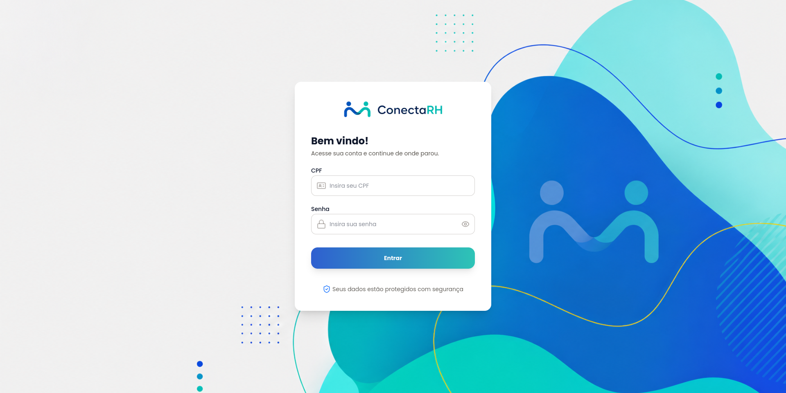

# ConectaRH




<p align="center">
  <strong>Plataforma inteligente de gestão de Recursos Humanos</strong>
</p>

<p align="center">
  Sistema desenvolvido para otimizar processos internos de RH, facilitando o gerenciamento de colaboradores, onboarding, solicitações e comunicação organizacional.
</p>

---

## Sobre o Projeto

O **ConectaRH** é uma plataforma web voltada para empresas que desejam centralizar e modernizar seus processos de Recursos Humanos.

A aplicação permite que gestores acompanhem colaboradores, realizem processos de admissão, controlem solicitações internas e tenham uma visão organizada das informações da equipe.

O objetivo é proporcionar uma experiência simples, eficiente e escalável para empresas que buscam digitalizar sua gestão de pessoas.

---

## Funcionalidades

### Gestão de colaboradores
- Cadastro e gerenciamento de funcionários;
- Visualização de informações profissionais;
- Organização dos dados da equipe.

### Onboarding de funcionários
- Processo digital de integração;
- Acompanhamento das etapas de admissão;
- Organização de documentos e informações iniciais.

### Dashboard administrativo
- Visão geral dos colaboradores;
- Indicadores importantes;
- Acompanhamento dos processos internos.

### Solicitações internas
- Solicitação de afastamentos e férias;
- Fluxo de aprovação;
- Controle do histórico de solicitações.

### Comunicação interna
- Sistema de comunicação entre usuários;
- Centralização de informações importantes.

---

# Tecnologias utilizadas

## Front-end
- Next.js
- React
- TypeScript
- Tailwind CSS

## Back-end
- Node.js
- Next.js API Routes

## Banco de Dados
- Prisma ORM
- PostgreSQL

## Ferramentas
- Git
- GitHub
- Vercel

---

# Estrutura do Projeto

```text
ConectaRH/
│
├── app/          # Rotas e páginas da aplicação Next.js (App Router)
│
├── components/   # Componentes reutilizáveis da interface (UI)
│
├── lib/          # Funções auxiliares, utilitários e configurações
│
├── prisma/       # Schema e arquivos de migração do banco de dados (Prisma)
│
├── public/       # Arquivos estáticos (imagens, fontes, etc.)
│
├── package.json  # Dependências, metadados e scripts do projeto
│
└── README.md     # Documentação do projeto

``

## Deploy

**Projeto publicado:** [Conecta RH - Beta](https://conecta-rh-beta.vercel.app)

---

## Segurança

O projeto utiliza boas práticas de desenvolvimento para garantir a integridade e proteção da aplicação:

* Controle de acesso;
* Validação de dados;
* Separação de responsabilidades;
* Gerenciamento seguro de variáveis de ambiente.

---

## 👨‍💻 Desenvolvedor

**Vítor Lorran** > *Projeto desenvolvido com foco em soluções modernas para gestão empresarial e transformação digital.*

---